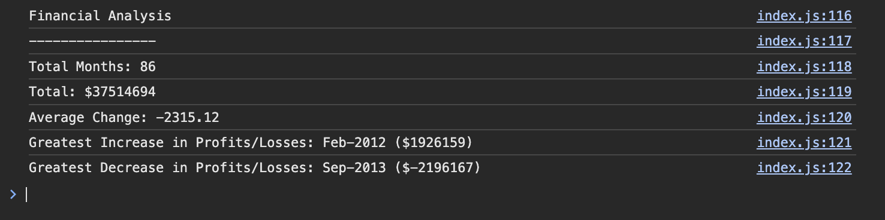

# module-4-javascript-fundamentals-console-finances
In this challenge, you'll be using the concepts you've learned to create a financial analysis tool ༊*·˚

## Installation 

To use this tool, follow these steps: 

1. Clone the repository:

git clone https://github.com/texndo module-4-javascript-fundamentals-console-finances

2. Navigate to the project directory: 

cd module-4-javascript-fundamentals-console-finances

3. Open the 'index.js' file and replace the 'finances' array with your own financial data

## Usage 

Open the console in your 'index.html' file and the financial results should be printed to the console. This will include: 

- Total months
- Total profits/losses
- Average change 
- Greatest increase in profits/losses (with date and amount)
- Greatest decrease in profits/losses (with date and amount)

## Live Demonstration

Follow the link to find a functional, final working version of the Financial Analysis Tool [insert link here]

## License

This project is licensed under the MIT License - see the LICENSE file for details.

